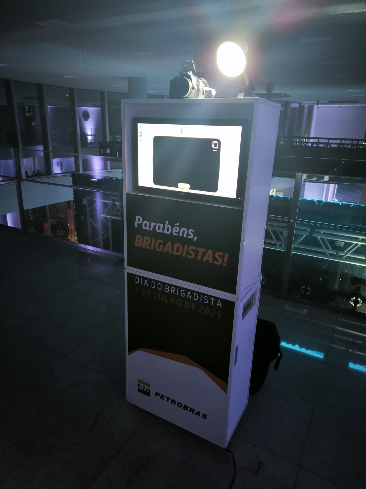

Em um evento corporativo, quase tudo disputa a atenção de quem está ali: o palco, o coffee, o celular. O que decide se a sua marca será lembrada depois é o que cada pessoa sentiu, e o que ela levou para casa.

Por isso as marcas estão investindo cada vez mais em experiências, e não só em mensagens. E a cabine fotográfica, que muita gente associa apenas a festas, virou uma das formas mais simples de transformar um evento em lembrança concreta.

## Experiência gera confiança, e confiança gera decisão

O relatório de tendências de eventos da Cvent para 2026 aponta que 72% dos participantes dizem tomar decisões de compra mais rápido quando participam de eventos, e que mais de 90% dos que passaram a confiar mais em uma marca depois de um evento acabaram comprando dela.1

<aside class="stat-aside"><strong>91%</strong>
dos participantes dizem se sentir mais otimistas sobre um produto ou serviço depois de participar ativamente de uma ativação de marca.1
</aside>

Assistir a uma apresentação é passivo. Entrar em uma cabine com os colegas, escolher os acessórios, rir da foto e sair com ela na mão é participar. É nesse momento que a marca deixa de ser um logo no banner e passa a fazer parte de uma lembrança boa.

*Totem personalizado com a identidade da campanha: a marca está em cada foto que vai para casa.*

## A foto é a parte do evento que vai para casa

Um brinde some na gaveta. Um folder vai para o lixo. Uma foto em que a pessoa está feliz, ao lado de quem gosta, costuma ir para a geladeira, para a mesa de trabalho ou para o celular. Quando essa foto leva as cores e a marca do evento, a lembrança e a marca passam a morar no mesmo lugar.

E essa lembrança circula. Segundo dados reunidos pela Cvent, marcas que investem em experiências geram três vezes mais boca a boca do que as que não investem, e 75% dos participantes dizem se sentir mais conectados à marca depois de um evento presencial.1 Com o link ou o QR Code das fotos, cada convidado vira alguém que compartilha o momento, sem precisar ser convencido.

## Em eventos internos, cuidar das pessoas também é reconhecer

Confraternizações, convenções e festas de fim de ano são, antes de tudo, momentos de reconhecimento. Uma pesquisa da Gallup com a Workhuman, que acompanhou cerca de 3.500 profissionais entre 2022 e 2024, mostrou que pessoas bem reconhecidas tinham 45% menos chance de ter deixado a empresa depois de dois anos. Ao mesmo tempo, só 22% dos profissionais disseram receber o reconhecimento que consideram adequado.2

Uma cabine não substitui uma cultura de reconhecimento, claro. Mas um evento em que cada pessoa é bem recebida, aparece na foto ao lado da equipe e leva essa lembrança para casa comunica, sem discurso, que ela faz parte daquilo.

## Como tirar o melhor da cabine no seu evento

1. **Leve a identidade da marca para a foto.** Moldura, cores e logo do evento transformam cada foto em uma peça da sua comunicação.
2. **Escolha um lugar com fluxo.** Perto da entrada, do coffee ou do bar, a experiência atrai quem está chegando e não compete com o palco.
3. **Tenha alguém cuidando das pessoas.** Um assistente que convida, orienta e ajuda com os acessórios faz quem é mais tímido entrar na foto.
4. **Facilite o compartilhamento.** Link ou QR Code para baixar as fotos ainda durante o evento prolonga o alcance da ação.
5. **Combine o formato com o objetivo.** Em ativações, totens e a [Cabine 360°](/servicos/cabine-360) chamam atenção; em eventos internos, a [Cabine Tradicional](/servicos/cabine-tradicional), a [VIP](/servicos/cabine-vip) e o [Paparazzo](/servicos/paparazzo-varal) registram a equipe junta; em feiras, os [totens compactos](/servicos/totem-led-foto-lembranca) lidam bem com muita gente passando.

## O que fica depois do evento

Os números ajudam a justificar o investimento, mas o motivo é mais simples: pessoas se lembram de quem cuidou bem delas. Quando uma marca oferece um momento em que cada convidado se sente importante, e deixa a prova desse momento na mão dele, ela vira parte de uma boa lembrança.
