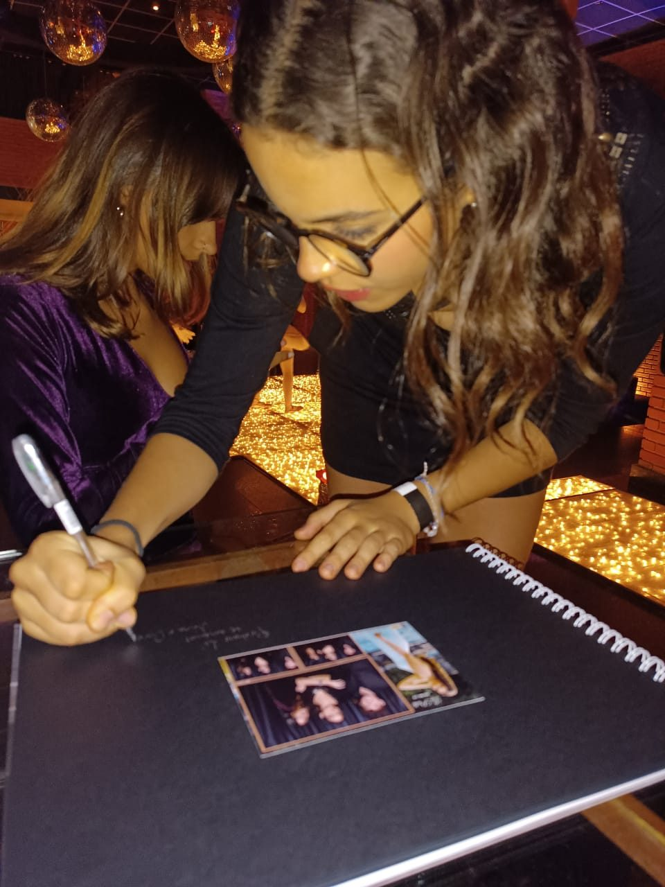

Um casamento dura uma noite. Uma festa de 15 anos passa num piscar de olhos. A formatura termina antes de a gente entender que acabou. O que fica depois são as lembranças, e a ciência tem boas pistas de por que vale tanto a pena cuidar delas.

## Fotografar muda o jeito como a gente lembra

Em 2017, pesquisadores de universidades americanas publicaram na revista Psychological Science uma série de experimentos sobre fotos e memória. No principal, 294 pessoas visitaram uma exposição de museu: algumas podiam fotografar, outras não. Quem estava com a câmera lembrou melhor do que viu, inclusive das peças que não chegou a fotografar.1

O mesmo estudo mostrou o outro lado: quem fotografava prestou menos atenção ao áudio do guia. Ou seja, a câmera direciona a atenção para o que se vê. Por isso faz diferença ter alguém cuidando do registro enquanto você vive o resto: a conversa, a música, o abraço.

*O álbum de recados reúne as fotos impressas na hora e as mensagens dos convidados em um só lugar.*

## Rever fotos pessoais melhora o humor

A psicóloga Krystine Batcho, professora do Le Moyne College e pesquisadora de nostalgia, reuniu estudos recentes sobre o efeito de rever fotos. Em experimentos de 2020 e 2023, olhar fotos pessoais foi mais eficaz para melhorar o humor do que olhar imagens genéricas: diminuiu emoções negativas e aumentou as positivas, porque despertou memórias com significado emocional.2

## Nostalgia é um sentimento que aproxima

Os psicólogos Constantine Sedikides e Tim Wildschut, da Universidade de Southampton, estudam a nostalgia há mais de duas décadas. Em uma revisão publicada em 2025, eles resumem o que as pesquisas encontraram: lembrar de momentos queridos aumenta a sensação de pertencimento, dá mais sentido à vida, fortalece a ligação entre quem fomos e quem somos e melhora o humor.3

A foto do seu casamento guarda também as pessoas que estavam ao seu lado, e ajuda a manter essas relações vivas.

<figure class="pull"><blockquote>“Guardamos momentos que o tempo não vai apagar!”</blockquote><cite>Daniela De Fatima, cliente Vivaze</cite></figure>

## Experiências valem mais do que coisas

<aside class="stat-aside"><strong>78%</strong>
dos jovens adultos preferem gastar com experiências do que com bens materiais, segundo pesquisa da Harris Poll para a Eventbrite.4
</aside>

Na mesma pesquisa, 69% disseram que participar de eventos os ajuda a se conectar com amigos e com a comunidade. Uma festa bem vivida é justamente isso: uma experiência compartilhada, que vira história contada por anos.

## Como registrar sem deixar de viver

1. **Deixe o registro com quem entende.** Assim você e sua família ficam livres para aproveitar.
2. **Prefira a foto na mão.** A foto impressa na hora vira presente, recado no álbum e lembrança na geladeira.
3. **Escolha a experiência pelo tipo de festa.** O [Espelho Mágico](/servicos/espelho-magico) combina com casamentos, a [Cabine Tradicional](/servicos/cabine-tradicional) com 15 anos, a [360°](/servicos/cabine-360) com formaturas.

No fim, registrar um grande momento é uma forma de cuidado: com você, com quem esteve lá e com quem ainda vai ouvir essa história.
